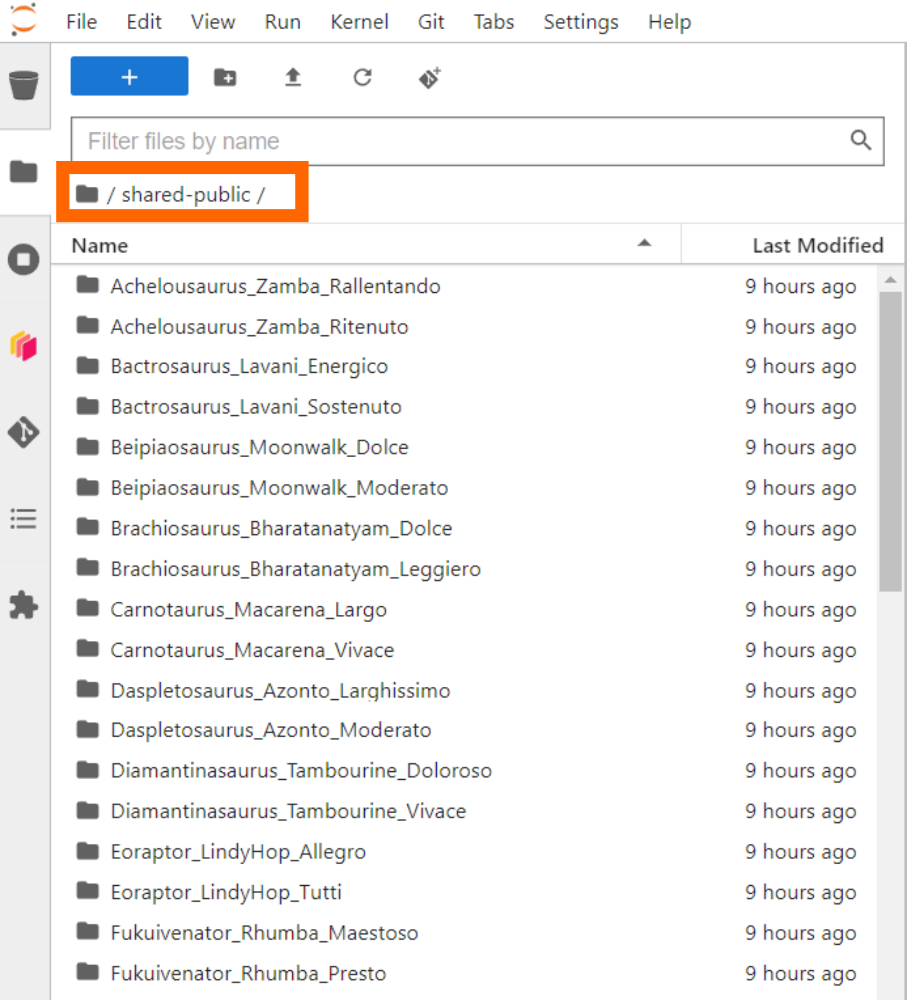
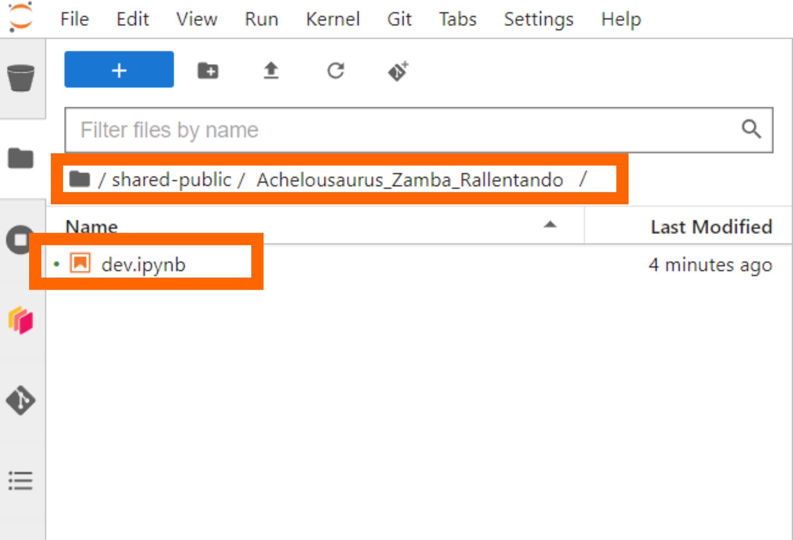

# **Using JupyterHub**

The JupyterHub is a cloud-based platform that provides a seamless coding environment able to interact with climate datasets and pre-installed python packages to be used in the course. 

Unlike Google Colab and Kaggle, in the JupyterHub there is no need to _!pip install_ any packages or download data from osf. These should all be available already in the JupyterHub environment. We hope this experience will provide flexibility as you explore projects and practice the new skills you acquire over the next two weeks.

Note that if you live in a region with difficult access to the JupyterHub, the Climatematch Academy team has also subsetted datasets that can be loaded in Google Colab and Kaggle environments.

To read more about what a JupyterHub is: [https://jupyterhub.readthedocs.io/en/stable/](https://jupyterhub.readthedocs.io/en/stable/)

To read more about our collaborators at 2i2c that are providing this experience [https://2i2c.org/](https://2i2c.org/) 

##
### **STEPS:**

1. You should have already opened a Github account and provided the Climatematch Academy team your username. This step is necessary for you to be added to the course Github Team which enables access to the JupyterHub. 

2. Click the Rocketship button found on top of every page containing a tutorial. 

    

3. You may need to wait a couple minutes until a node becomes available, especially in the first login of the day.

    

    **Just in case, we recommend that you launch your first tutorial _before_ you begin watching the invited speaker’s video (or 30 minutes before you plan to start coding).**

4. Once your server has started, you will find an interactive coding environment.

    

5. We have preloaded datasets to the JupyterHub which are shared across all users. However, you will also have your own home directory where you can save notebooks and subsetted data you have analyzed. 

6. Note that other users will not be able to access your home directory. To collaborate over projects it is best practice to share code using git.

##
### **USING JUPYTERHUB TO COLLABORATE ON PROJECTS**

To help you share code, data, and plots, we have created a `shared-public` folder on JupyterHub. Each project group has a dedicated subfolder named after the group. **Work ONLY in your project group's folder!!!!**

Inside your group's folder, you will find a `dev.ipynb` notebook that you can use to develop code collaboratively. 

For best practices:
* Only work in your group's folder!!!! 
* Do not delete any code or data from this folder without the entire group's permission-- this cannot be restored!!
* One member can share their screen while the group works together on shared code. Note that it may take a few minutes for code to update so best to avoid multiple people updating code simultaneously. 
* Alternatively, you can also each develop code in a notebook on your local folder. If there are code snippets you would like to share you can place in dev.ipynb, where other team members can copy over to their local notebook/folder.
* We recommend everyone to still maintain a local copy of each notebook-- just in case.