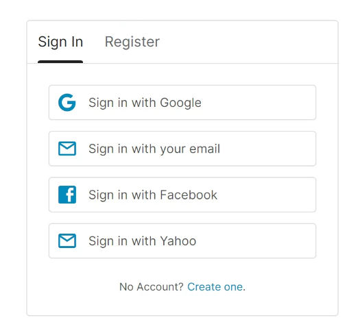
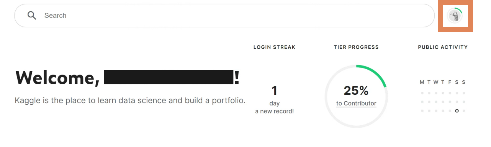
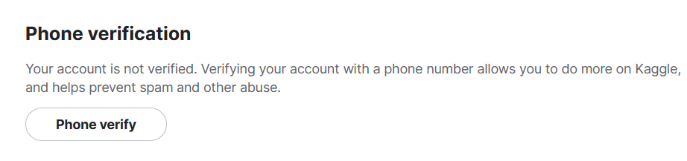
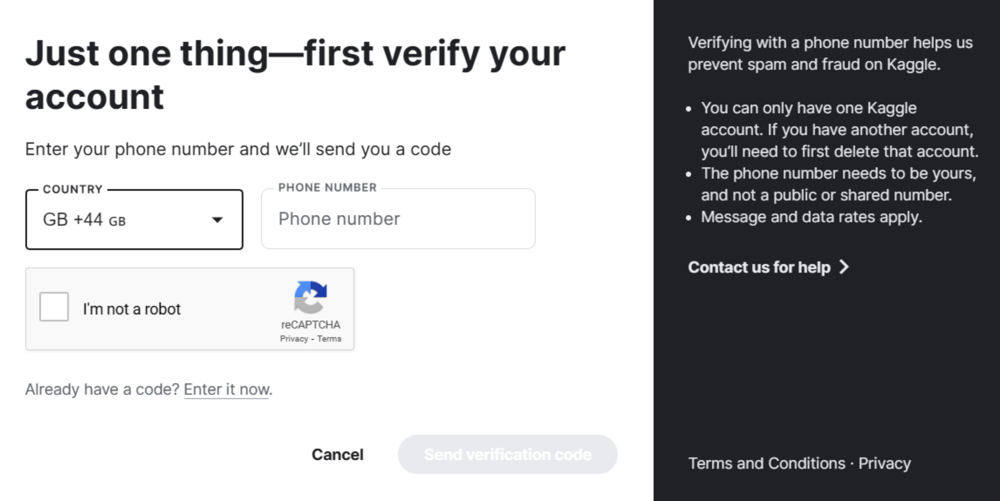
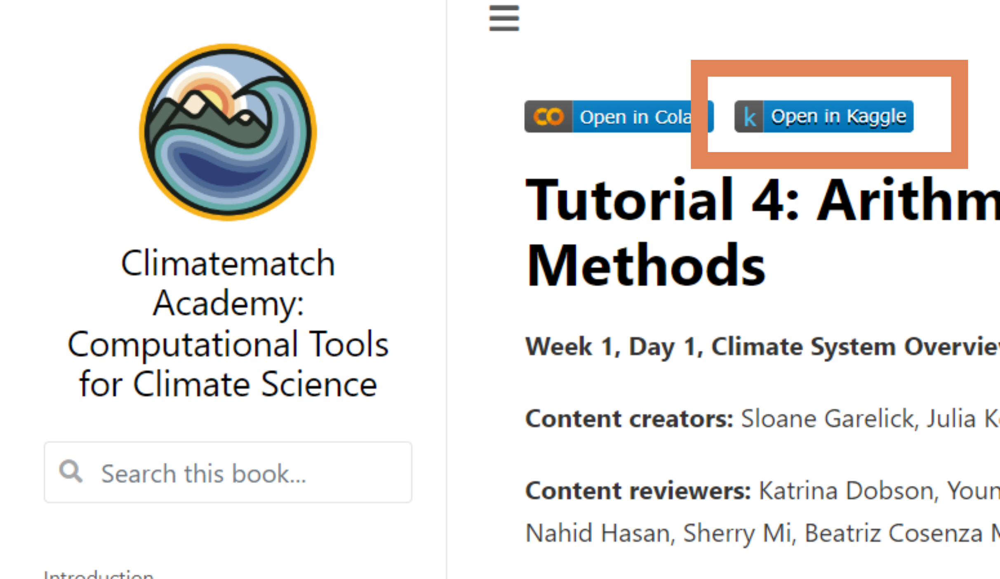
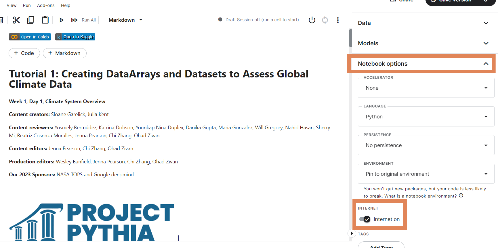
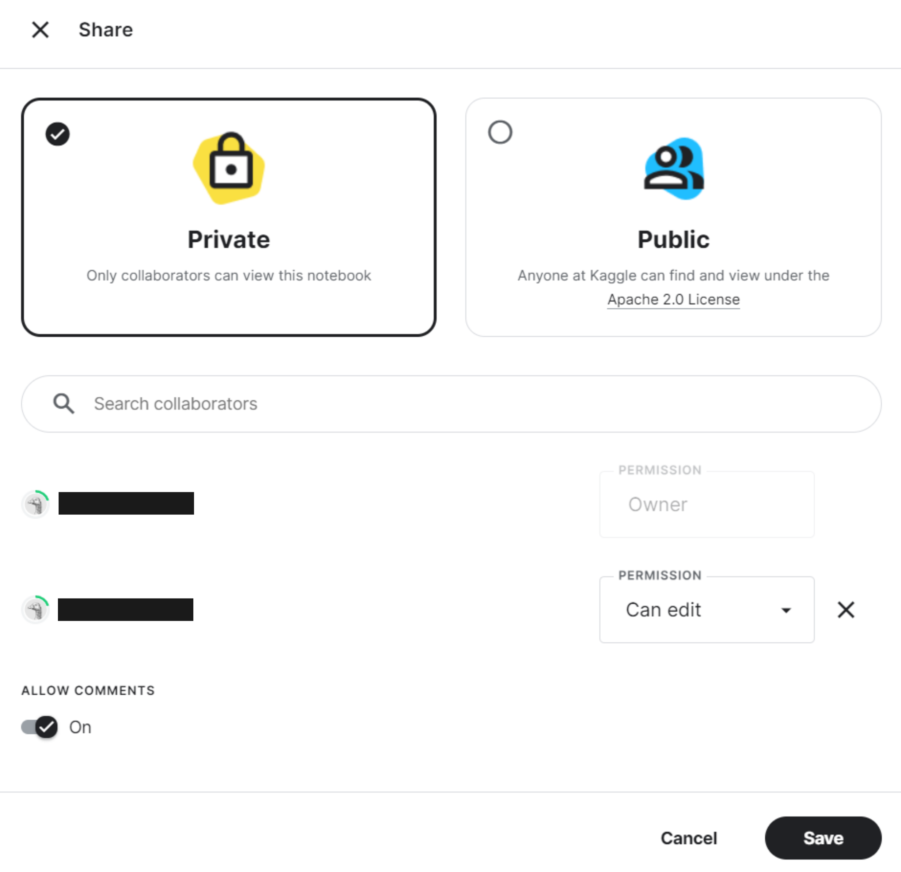

# Using Kaggle

If you are in China or another region with difficult access to JupyterHub and Google Colab, you can use Kaggle as a substitute for launching an interactive coding environment where you can write and run code. **Please note that we recommend JupyterHub if you can access it.**

## First use

**1.** First, [sign in](https://www.kaggle.com/account/login) to your Kaggle account. If you don't have a Kaggle account, create one by registering [here](https://www.kaggle.com/account/login?phase=startRegisterTab&returnUrl=%2F). 

**2.** Get your account phone-verified. This is necessary for accessing GPU/internet on kernels, as well as for collaborative work. To do this:
* click on your profile icon in the top right corner

* select `Settings` and scroll down to the `Phone verification` section

* enter your phone number and subsequently the code verification code received in a text message

## Accessing course notebooks
Click the kaggle button found on top of every page containing a jupyter notebook, such as [tutorial pages](https://comptools.climatematch.io/tutorials/W1D1_ClimateSystemOverview/student/W1D1_Tutorial1.html).

>**NOTE:** If you receive an error asocociated with `!pip install`, follow [this workaround](https://www.kaggle.com/product-feedback/63544).

## Enabling internet access on kernels
To enable this, click on `Notebook options` in the right side bar of the kaggle notebook editor. Scroll down and toggle `Internet on`.
This will let you fetch data from an external online source or install a custom python package. If after the installation you experience any error when trying to import an installed module, make sure to restart the kernel after installing the module and then it should work.

## Enabling GPU access on kernels
Click on `Notebook options` in the right side bar of the kaggle notebook editor as above. Change `Accelerator` from **None** to **GPU**.
 
>**NOTE:** A GPU is **NOT** required in the *Computational Tools for Climate Science* course! However, some advanced groups might design projects that benefit from GPU use.

## Collaborating in kaggle
To share a notebook with your project teammates, add them as **collaborators** by clicking `Share` in the top right corner of the notebook editor when you have the notebook of interest open. Keep the notebook as *Private* and search your teammates by their kaggle username. You can give them access to `view` or `edit` your work. This is also where you can **enable comments** for your notebook.

>**NOTE:** Unlike in Colab, collaborators **CANNOT** edit the same version of a notebook simultaneously! Your edits will be accessible to collaborators only after you `Save version` -> `Save & Run All (Commit)`, but they will not get merged into *their* working version of the notebook automatically. Commits from separate notebook versions must be merged manually!

To view your collaborators' work, open the **version history** by clicking on the number next to `Save Version` in the top right corner. Clicking on the three dots next to a specific version lets you view, rename, and pin it, as well as revert to it or compare it to another version.
